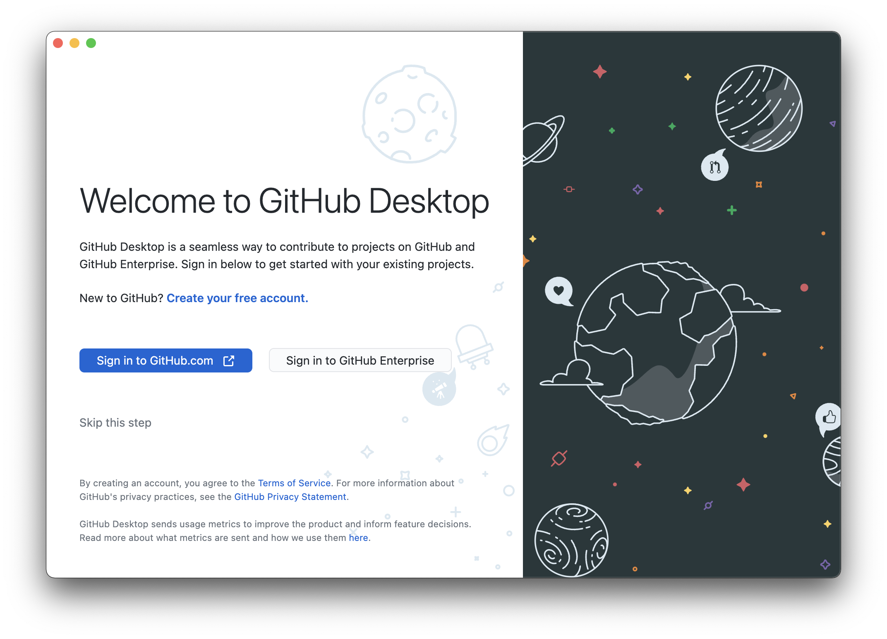
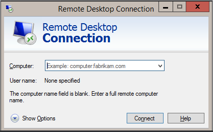
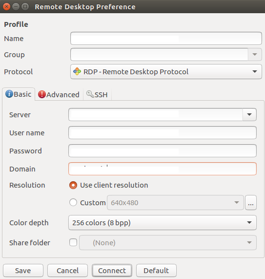
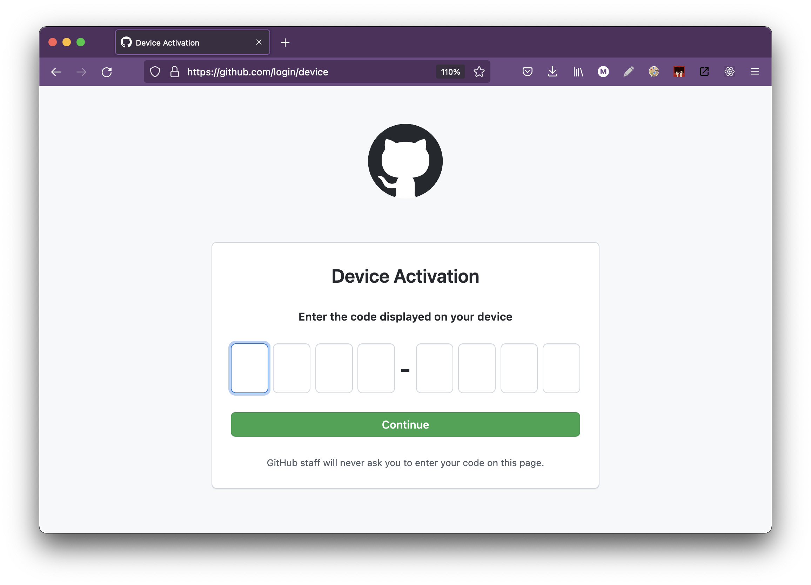
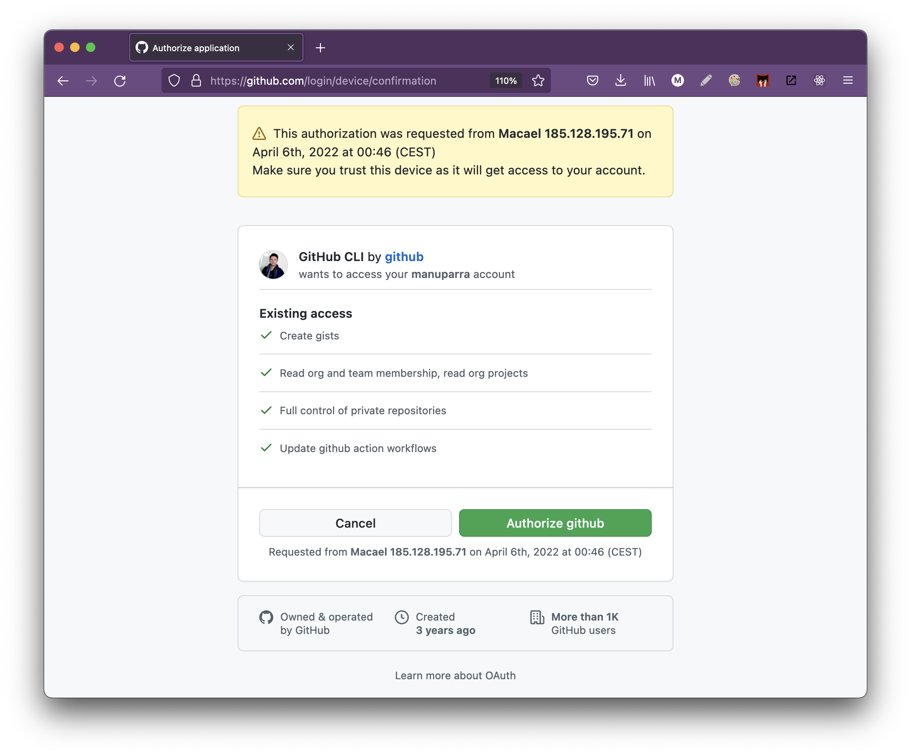
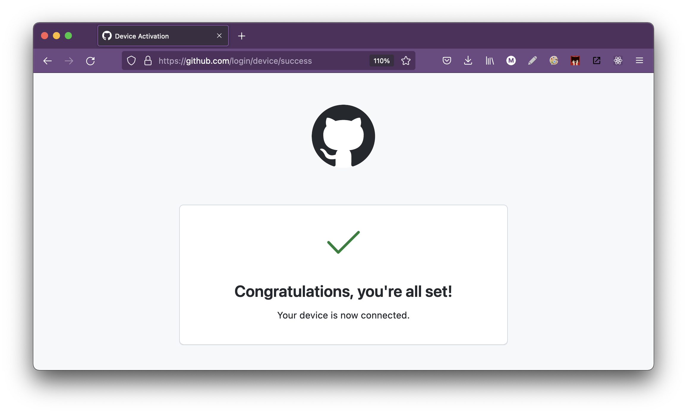

# Introduction to tools for repository management with `git`

**Table of contents**

<!-- vscode-markdown-toc -->
* 1. [Tools for `git`](#Toolsforgit)
* 2. [GIT desktop client](#GITdesktopclient)
* 3. [GIT from command line](#GITfromcommandline)
	* 3.1. [Git for Linux](#GitforLinux)
	* 3.2. [Git for MacOSX](#GitforMacOSX)
	* 3.3. [Git for Windows](#GitforWindows)
* 4. [Access to VM resources](#AccesstoVMresources)
	* 4.1. [How to access from a Web browser](#HowtoaccessfromaWebbrowser)
	* 4.2. [How to access from Remote Desktop for Windows](#HowtoaccessfromRemoteDesktopforWindows)
	* 4.3. [How to access from Remote Desktop for Linux](#HowtoaccessfromRemoteDesktopforLinux)
* 5. [Setting your username in Git for GitHub](#SettingyourusernameinGitforGitHub)
	* 5.1. [Setting your Git username for every repository on your computer](#SettingyourGitusernameforeveryrepositoryonyourcomputer)
	* 5.2. [Setting your credentials](#Settingyourcredentials)
		* 5.2.1. [Installing GitHub CLI (in your computer)](#InstallingGitHubCLIinyourcomputer)
		* 5.2.2. [Setting up credentials](#Settingupcredentials)

<!-- vscode-markdown-toc-config
	numbering=true
	autoSave=true
	/vscode-markdown-toc-config -->
<!-- /vscode-markdown-toc -->

<HR>

##  1. <a name='Toolsforgit'></a>Tools for `git`

As you know,  Git is a popular version control system that helps developers, writers, or anyone that requires keeping versions of their files to manage them and track changes. 

Many people use it mainly in the terminal or command line, although there are several applications that allow us to manage the use of our repository from completely visual tools, for example in the previous session we saw github from a website, but we also have the option of installing a git client for our computer as we will see later.

##  2. <a name='GITdesktopclient'></a>GIT desktop client

As we know, Git is necessary when it comes to managing collaborative development projects. Although, it also has a high learning curve. Thus, to make it easier for newcomers, developers, general public, etc.  have created Git Graphical User Interface clients for various platforms.

Here we recommend the standard github client called GitHub Desktop which works on Mac, Windows and Linux, is free and allows you to manage repo cloning, push-pull commands, merge conflicts, versioning, etc.

Here is the link to download: https://desktop.github.com/

Once downloaded, install it and you can start to use the application:



Then log-in from this application with GitHub


Finally you can start playing with the client of `git` from your personal computer desktop.


##  3. <a name='GITfromcommandline'></a>GIT from command line

There are many different ways to use Git. There are the original command-line tools, and there are many graphical user interfaces of different capabilities. The most widespread option for using Git is on the command line. 

For one thing, the command line is the only place where you can run all of Git's commands - most GUIs implement only a partial subset of Git's functionality for simplicity.

Also, while your choice of graphical client is a matter of personal taste, all users will have command-line tools installed and available on their system, especially if they use Linux or Mac (they already include it by default), and in the case of Windows, you can use some desktop client that adds command-line support.


###  3.1. <a name='GitforLinux'></a>Git for Linux

Depending on your Linux distribution, you can use the following options.

**Debian / Ubuntu (with apt-get)**

From your shell, install Git using apt-get:

```
sudo apt-get update
sudo apt-get install git
```

Verify the installation was successful by typing `git --version`

**Fedora (dnf or yum)**

From your shell, install Git using dnf (or yum, on older versions of Fedora and CentOS):

```
sudo dnf install git or sudo yum install git
```

Verify the installation was successful by typing `git --version`

###  3.2. <a name='GitforMacOSX'></a>Git for MacOSX

There are several ways to install Git on a Mac. If you’ve installed XCode (or it’s Command Line Tools), Git may already be installed. To find out, open a terminal and enter `git --version`. If the command returns the git version, then it is installed, otherwise you can install Xcode from the App Store or use the other methods below.

**Install Git on a Mac is via the stand-alone installer**

- Download the latest Git for Mac installer here and then install it.
- Open a terminal and verify the installation was successful by typing `git --version`.

**Install Git with Homebrew**

First you need to have HomeBrew installed, after that follow the next:

- Open your terminal and install Git using Homebrew: brew install git.
- Verify the installation was successful by typing `git --version`.

###  3.3. <a name='GitforWindows'></a>Git for Windows

Download the latest [Git for Windows](https://www.google.com/url?q=https://git-for-windows.github.io/&sa=D&source=editors&ust=1642764538497386&usg=AOvVaw0EAVw71DR5KUNL54vma1Zz) installer and then install it.

Then, open a Command Prompt (or Git Bash if during installation you elected not to use Git from the Windows Command Prompt), and verify the installation was successful by typing git --version and checking it’s showing a version greater or equal than 2.34.

##  4. <a name='AccesstoVMresources'></a>Access to VM resources

In order to make the most efficient use of this course we have created a Virtual Machine that has all the software resources that will be used in the reproducibility course. For this session we have enabled a workspace and a virtual desktop with git command line, in order to be able to do all the training of this session from a window (called terminal) that we have enabled.

To use these resources it is only necessary to have a web browser and to have received the access credentials to the Virtual Machine. 

###  4.1. <a name='HowtoaccessfromaWebbrowser'></a>How to access from a Web browser

To access open a tab in your browser and click on the following address: https://spsrc14.iaa.csic.es/guacamole/#/ 


Use your username and password that you should have in the credentials and access email that has been sent for this second session. 

**:warning: :warning:  Once you have done this you will be asked again for your username and password, enter it by hand, for security reasons copy/paste has been disabled.**


Once this is done you will see a linux desktop screen. 


If you click on the 'Terminal' icon, you can follow the instructions for this session within the next steps.


###  4.2. <a name='HowtoaccessfromRemoteDesktopforWindows'></a>How to access from Remote Desktop for Windows

This option is only if you are working from a Windows computer. To access the VM for the course, open the "Remote Desktop" (or "Escritorio Remoto") application.

Once you have done this, enter the following name where it says "Computer": 

> spsrc14.iaa.csic.es:18020

*This is the host and port to access with Remote Desktop*



Click on connect and it will ask for your credentials. When you finish connecting (accept all the confirmations), the working desktop and the access terminal for `git` will appear.


If you click on the 'Terminal' icon, you can follow the instructions for this session within the next steps.


###  4.3. <a name='HowtoaccessfromRemoteDesktopforLinux'></a>How to access from Remote Desktop for Linux

This option is only if you are working from a Linux computer. To access the VM for the course, install REMMINA following this [tutorial](https://remmina.org/how-to-install-remmina/).

Once you have done this, enter the following name where it says "Server", change the protocol to "RDP" and add your credentials (user and password) to connect directly: 



After that you will see:


If you click on the 'Terminal' icon, you can follow the instructions for this session within the next steps.


##  5. <a name='SettingyourusernameinGitforGitHub'></a>Setting your username in Git for GitHub

Git uses a username to associate commits with an identity. 

You can change the name that is associated with your Git commits using the git config command. The new name you set will be visible in any future commits you push to GitHub from the command line. If you'd like to keep your real name private, you can use any text as your Git username.

Changing the name associated with your Git commits using git config will only affect future commits and will not change the name used for past commits.

###  5.1. <a name='SettingyourGitusernameforeveryrepositoryonyourcomputer'></a>Setting your Git username for every repository on your computer

1. Open Terminal.

2. Set a Git username:

```
git config --global user.name "Manuel Parra"
```

3. Confirm that you have set the Git username correctly:

```
git config --global user.name
```

###  5.2. <a name='Settingyourcredentials'></a>Setting your credentials

####  5.2.1. <a name='InstallingGitHubCLIinyourcomputer'></a>Installing GitHub CLI (in your computer)

GitHub CLI that it will automatically store your Git credentials for you when you choose HTTPS as your preferred protocol for Git operations and answer "yes" to the prompt asking if you would like to authenticate to Git with your GitHub credentials.

1. Install [GitHub CLI](https://github.com/cli/cli#installation) for macOS, Windows, or Linux.
2. In the command line, enter `gh auth login`, then follow the prompts.
  - When prompted for your preferred protocol for Git operations, select `HTTPS`.
  - When asked if you would like to authenticate to Git with your GitHub credentials, enter `Y`.

####  5.2.2. <a name='Settingupcredentials'></a>Setting up credentials 

We are going to use `gh` command to set our credentials. 

Open a terminal, and type:

```
gh auth login
```


You will be asked `What account do you want to log into?`

Select `> GitHub.com`


Then you will be asked `What is your preferred protocol for Git operations?`

Select `> HTTPS`


After that, you will be asked `How would you like to authenticate GitHub CLI?`

Select `> Login with a web browser`

You will see a CODE like this: `First copy your one-time code: OF86-AD4A`

Press `Enter`


If a browser is opened, paste the CODE that you see.



If not, open a browser, and open this link: https://github.com/login/device and paste the CODE.





After that you will see in the terminal window that your credentials are stored.

